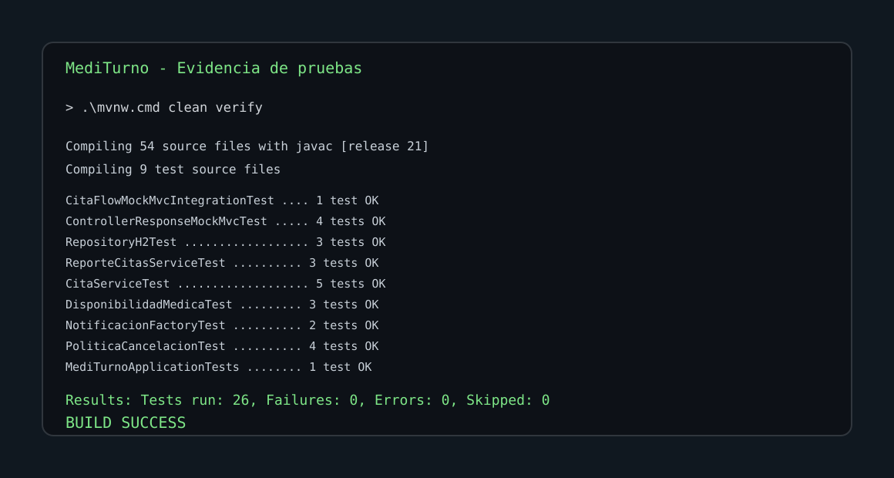
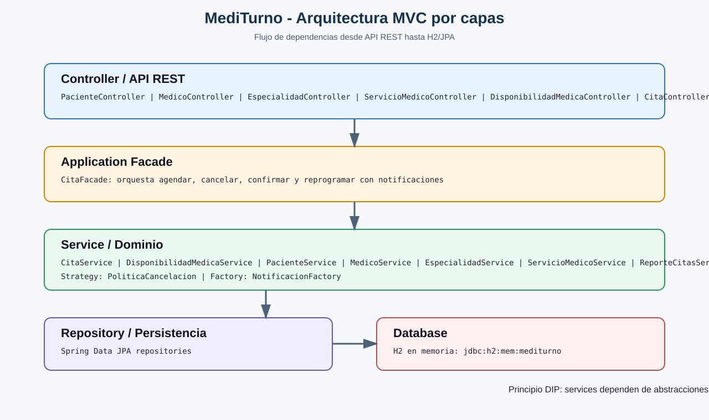
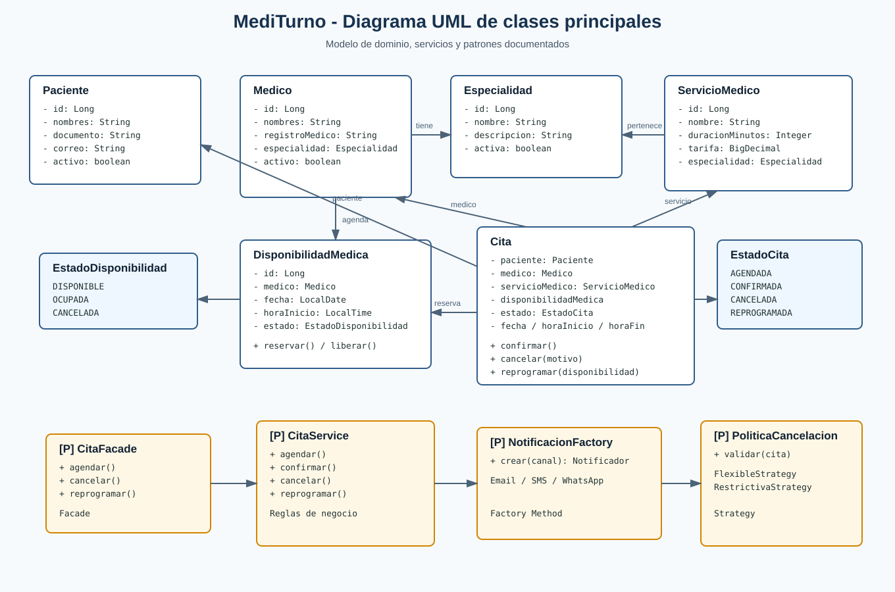
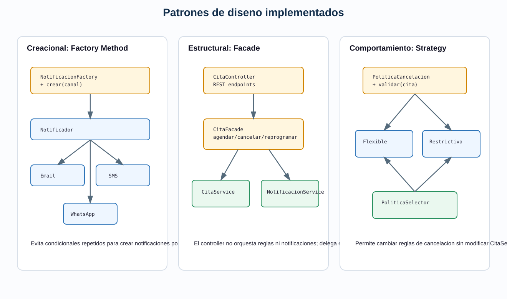
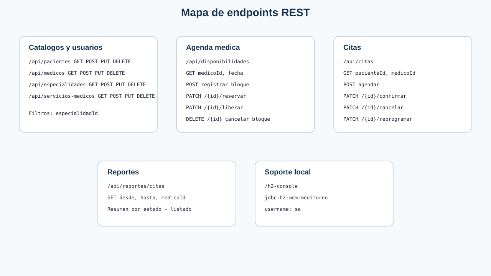
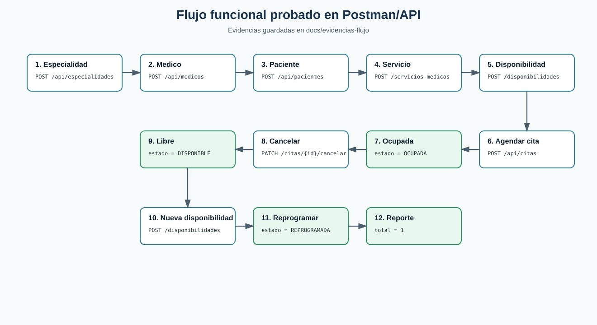

# MediTurno

Sistema de gestion de citas medicas construido con Spring Boot, Spring Data JPA y H2. 

## Estado actual

- Compila con Java 21.
- Usa Maven Wrapper: `mvnw.cmd`.
- Base de datos local H2 en memoria.
- API REST lista para probar con Postman.
- Patrones implementados en codigo: Facade, Factory Method y Strategy.
- Pruebas unitarias con JUnit 5 y Mockito.

## Ejecutar

```powershell
.\mvnw.cmd spring-boot:run
```

Aplicacion:

- API: `http://localhost:8080`
- H2 Console: `http://localhost:8080/h2-console`
- JDBC URL: `jdbc:h2:mem:mediturno`
- User: `sa`
- Password: vacio

## Ejecutar pruebas

```powershell
.\mvnw.cmd clean verify
```

Resultado esperado:

```text
Tests run: 26, Failures: 0, Errors: 0, Skipped: 0
BUILD SUCCESS
```



## Arquitectura



Capas principales:

- `controller`: endpoints REST.
- `facade`: fachada para casos de uso complejos de citas.
- `service`: reglas de negocio.
- `repository`: persistencia con Spring Data JPA.
- `model`: entidades JPA del dominio.
- `factory`: notificaciones por canal.
- `strategy`: politicas de cancelacion.

## Modelo de clases



Clases de dominio principales:

- `Paciente`
- `Medico`
- `Especialidad`
- `ServicioMedico`
- `DisponibilidadMedica`
- `Cita`
- `EstadoCita`
- `EstadoDisponibilidad`

## Patrones de diseno



- **Facade**: `CitaFacade` orquesta `CitaService` y `NotificacionService`.
- **Factory Method**: `NotificacionFactory` crea `EmailNotificacion`, `SmsNotificacion` o `WhatsAppNotificacion`.
- **Strategy**: `PoliticaCancelacion` tiene estrategias `CancelacionFlexibleStrategy` y `CancelacionRestrictivaStrategy`.

## Endpoints



Rutas principales:

- `/api/pacientes`
- `/api/medicos`
- `/api/especialidades`
- `/api/servicios-medicos`
- `/api/disponibilidades`
- `/api/citas`
- `/api/reportes/citas`

## Flujo funcional probado



Flujo minimo:

1. Crear especialidad.
2. Crear medico asociado.
3. Crear paciente.
4. Crear servicio medico.
5. Registrar disponibilidad.
6. Agendar cita.
7. Verificar disponibilidad ocupada.
8. Cancelar cita.
9. Verificar disponibilidad libre.
10. Registrar nueva disponibilidad.
11. Reprogramar cita.
12. Generar reporte.

Archivos utiles:

- Guia Postman: [docs/postman-flujo-completo.md](docs/postman-flujo-completo.md)
- Coleccion Postman: [docs/MediTurno.postman_collection.json](docs/MediTurno.postman_collection.json)
- Evidencias JSON: [docs/evidencias-flujo](docs/evidencias-flujo)
- Documentacion final: [docs/documentacion-entrega-final.md](docs/documentacion-entrega-final.md)
- Resumen tecnico: [docs/resumen-tecnico-codigo.md](docs/resumen-tecnico-codigo.md)

## Pruebas existentes

- `MediTurnoApplicationTests`: carga del contexto Spring.
- `CitaFlowMockMvcIntegrationTest`: flujo HTTP completo con `MockMvc`.
- `ControllerResponseMockMvcTest`: respuestas `201`, `400`, `404` y `204`.
- `RepositoryH2Test`: queries reales con H2 para solapamientos, filtros y citas activas.
- `CitaServiceTest`: agendar, rechazar disponibilidad ocupada, cancelar, reprogramar.
- `ReporteCitasServiceTest`: reporte por rango, filtro por medico y validacion de fechas.
- `DisponibilidadMedicaTest`: reservar, liberar, rechazar reserva repetida.
- `NotificacionFactoryTest`: crear notificacion por canal y canal por defecto.
- `PoliticaCancelacionTest`: estrategias flexible y restrictiva.

## Cobertura y calidad

- JaCoCo queda configurado en Maven y genera el reporte con `.\mvnw.cmd clean verify`.
- Reporte HTML: `target/site/jacoco/index.html`.
- Reporte XML para Sonar: `target/site/jacoco/jacoco.xml`.
- Cobertura actual despues de `clean verify`: lineas `74.69%`, instrucciones `68.83%`, clases `100%`.
- SonarQube queda preparado con `sonar-project.properties`.

Ejemplo para ejecutar SonarQube local:

```powershell
.\mvnw.cmd clean verify
.\mvnw.cmd sonar:sonar -Dsonar.host.url=http://localhost:9000 -Dsonar.token=TU_TOKEN
```
